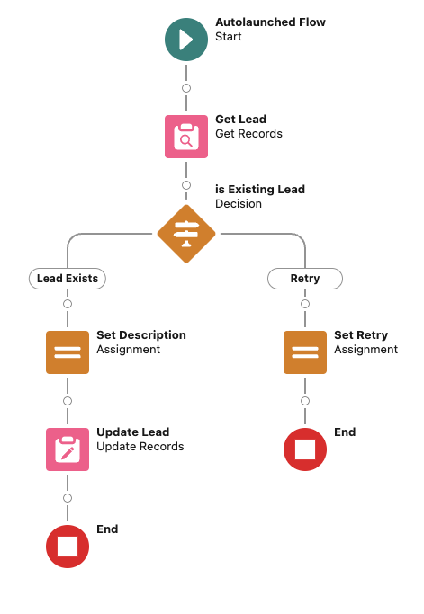

# platform-event-trigger-flow-retryer

A simple way to enable App Builders to create Flows that can be retried when processing Platform Events

## Install

`npm install @guimini/platform-event-trigger-flow-retryer`

Then add it as a package directory by editing `sfdx-project.json`

```
"packageDirectories": [
    [...],
    {
      "path": "node_modules/@guimini/platform-event-trigger-flow-retryer/force-app"
    }
  ],
```

## Usage

### Prepare your flow

Create an `autolauched` flow, based on template `RetryablePlatformEventFlowTemplate`.
Add an input variable for your platform event.
Add your logic.
Should the vent need to be retried, assign `retry=true` and `retryReason` to any string explaning why the event needs to be retried.

See `Retryable_Platform_Event_Flow`


### Prepare your trigger

Create an Apex trigger for your platform event.

```
trigger SamplePlatformEventTrigger on SamplePlatformEvent__e(after insert) {
  PlatformEventFlowRetryer retrier = new PlatformEventFlowRetryer(
    'Retryable_Platform_Event_Flow' // api name of the flow you just created
  );
  for (SamplePlatformEvent__e pe : Trigger.New) {
    retrier.start(new Map<String, Object>{ 'platformEvent' => pe }); // must reflect the variable name you created
    EventBus.TriggerContext.currentContext().setResumeCheckpoint(pe.ReplayId);
  }
}
```

## Publish to NPM

I do not have time to setup a full CI/CD for something that should not move that much
Simply run this by hand
`npm publish`
